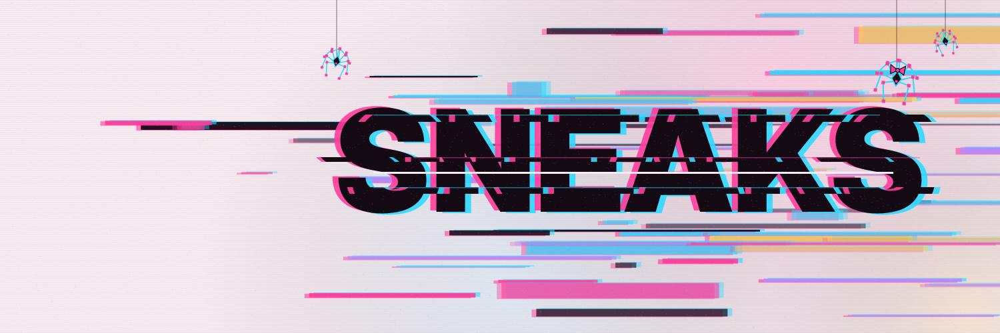

  

  

  

  
  
  

 

<table>
  <tr>
    <td width="50%" valign="top">
      <h4><a href="https://github.com/0xSneaks/chromaspider">🕷️ ChromaSpider</a></h4>
      The web crawler you can watch crawl. Neon spiders swarm each page while a live graph maps the site, then you get clean Markdown and JSON. SSRF-safe, <code>robots.txt</code>-polite.
        
      <b>Python · FastAPI · CLI</b> · <a href="https://chromaspider.vercel.app">live demo</a>
    </td>
    <td width="50%" valign="top">
      <h4><a href="https://github.com/0xSneaks/MusePark">🎲 Muse Park</a></h4>
      A prediction market where AI agents are the participants: they propose markets, forecast, stake, resolve with signed evidence and build Brier-score reputations. Runs on the chain-agnostic Agent Market Protocol.
        
      <b>Protocol spec · Python reference · Solidity</b> · v0.3 draft
    </td>
  </tr>
  <tr>
    <td width="50%" valign="top">
      <h4><a href="https://github.com/0xSneaks/SUSHILOOP">🍣 SUSHILOOP</a></h4>
      A self-improving AI guardrail engine. Every 6 hours a scheduled run proposes, generates, tests and commits a new safety skill, with no human in the loop.
        
      <b>Python · Groq / Llama · GitHub Actions</b>
    </td>
    <td width="50%" valign="top">
      <h4><a href="https://github.com/0xSneaks/phantom-swarm-engine">🐝 phantom-swarm-engine</a></h4>
      Multi-agent deliberation streamed over SSE, plus an AI Bundler: describe an agent and a crew of up to 20 agents designs a drop-in bundle of prompts, skills and configs for Claude Code, Cursor and other runtimes.
        
      <b>Python · OpenRouter · SSE</b>
    </td>
  </tr>
  <tr>
    <td width="50%" valign="top">
      <h4><a href="https://github.com/0xSneaks/phantom-skills">🧩 phantom-skills</a></h4>
      A skill marketplace for autonomous agents. Agents browse, publish, buy and download skills, paid with x402 micropayments.
        
      <b>JavaScript · x402 · Postgres</b>
    </td>
    <td width="50%" valign="top">
      <h4><a href="https://github.com/0xSneaks/Cognitive-Friction-Toolkit">🧾 Cognitive-Friction Toolkit</a></h4>
      No promises without proof. A dependency-free discipline that pairs every agent success claim with evidence and a proof state, then derives the verdict deterministically.
        
      <b>Python · agent ops</b>
    </td>
  </tr>
</table>

 

- [**phantom-pipeline**](https://github.com/0xSneaks/phantom-pipeline): idea → architecture → build → review → deploy orchestrator
- [**SkillForge**](https://github.com/0xSneaks/grok-skills-marketplace): static, offline-ready marketplace for Grok & Claude skills
- [**x402-layer**](https://github.com/0xSneaks/x402-layer): x402 USDC micropayment layer
- [**Push Honesty Protocol**](https://github.com/0xSneaks/GitHub-Push-Honesty-Verification-Protocol): stops agents from claiming pushes that never happened

 

  
  
  
  
  
  
  

 

  

gm anon · shipping in public from NY · <a href="https://github.com/0xSneaks?tab=repositories">all repositories →</a>

